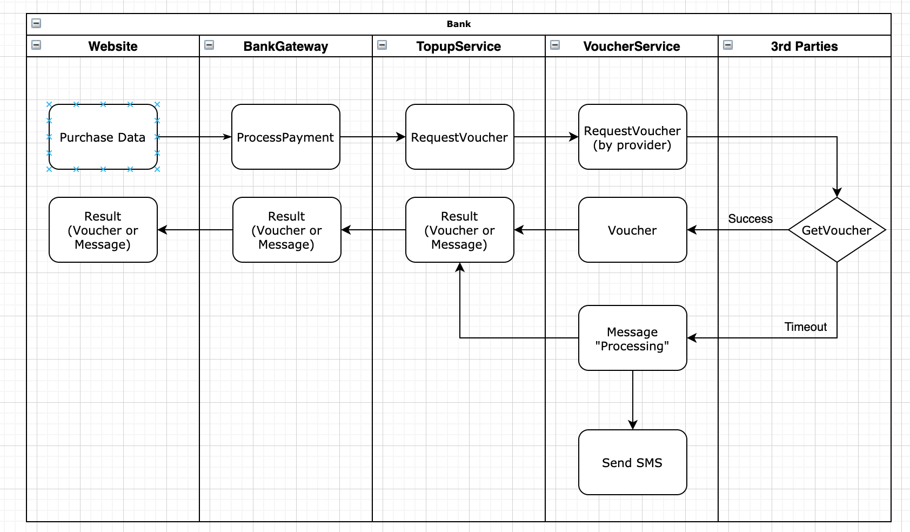
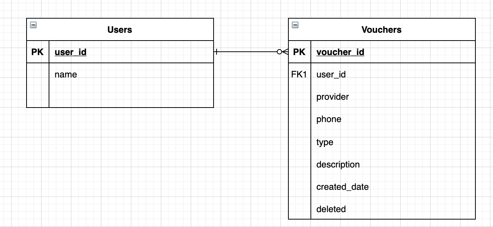

## BankTopup
  Powered by: Spring Boot, JPA (Hibernate), H2Database, JUnit
  
### Features:
  1. Purchase prepaid data for a SIM card by getting voucher code from 3rd parties.<br/> 
  2. The customer can check all the voucher codes that they have purchased by phone number.
  
  
### Services:
  1. TopupService (an API gateway to process all topup requests)
  2. VoucherService (an Facade service to work with 3rd parties)

### Solution Design
  #### Purchase Data
  1. Website call **TopupService** with data (paymentId, phoneNumber, provider, dataPlan) to get a voucher code (Assume payment has been done before)
  2. **TopupService** send an <ins>async</ins> request to **VoucherService** with data (phoneNumber, provider, dataPlan)
  3. **VoucherService** find a 3rd Party named by **provider** and send a request to get Voucher code.</br>
    3a. If 3rd Party return a voucher code in 3 seconds, then return the code to the website.</br>
    3b. Otherwise return a message that says the request is being processed within 30 seconds. Send the code later via SMS.
  4. Store the voucher code to database.

  #### List all vouchers by phoneNumber
  1. Website call **TopupService** with username and phoneNumber
  2. **TopupService** find all voucher codes that match (username, phoneNumber) (**TODO**: supporting pagination)
  3. Return the list of voucher codes to the website
  



### Prerequisites
* **_JDK 8_**
* **Maven**
* **_IntelliJ IDEA Community Edition [Optional]_**

## Installation
#### How to get source code
```
git clone https://github.com/NathanMBui/bank-topup.git
cd bank-topup
```
#### How to build
```
mvn clean install
```
#### How to run
Order | Service | Running Port | Command line
--- | --- | --- | --- 
`1` | voucher-service | 8081 | java -jar target/voucher-service-0.0.1.jar |
`2` | topup-service | 8080 | java -jar target/topup-service-0.0.1.jar |

#### How to use
Using below curl commands
1. Purchase Voucher
```
curl --location --request POST 'http://localhost:8080/topup' \
--header 'Content-Type: application/json' \
--header 'username: xyz' \
--data-raw '{"paymentId": "p123", "phoneNumber": "1234567890", "provider": "Viettel", "type": "ST90"}'
```
2. Get list of Voucher by phone number
```
curl --location --request GET 'http://localhost:8080/topup?phoneNumber=1234567890' \
--header 'Content-Type: application/json' \
--header 'username: xyz' \
--data-raw ''
```
3. Get voucher code (not allowed to be called directly from website in production)
```
curl --location --request POST 'http://localhost:8081/vouchers' \
--header 'Content-Type: application/json' \
--header 'username: xyz' \
--data-raw '{"phoneNumber": "1234567890", "provider": "Viettel", "type": "ST70"}'
```

### REST API
#### TopupService.

Method | URI | Description | Parameters | Request JSON | Response JSON
------ | --- | ----------- | ---------- | ------------ | -------------
`GET` | */topup* | List of vouchers | phoneNumber | | {"phoneNumber":(string), "vouchers": [{"code":(string), "type":(string), "provider":(string), "description":(string)}]}
`POST` | */topup* | Purchase a voucher | | {"paymentId":(string), "phone": (string), "provider": (string), "type": (string)} | {"message":(string), "voucherCode": (string)} |

#### VoucherService.

Method | URI | Description | Parameters | Request JSON | Response JSON
------ | --- | ----------- | ---------- | ------------ | -------------
`POST` | */vouchers* | Get a voucher from 3rd party| | {"phoneNumber": (string), "provider": (string), "type": (string)} | {"code":(string), "type":(string), "provider":(string), "description":(string)} |

### TODO
1. Authentication + Authorization (Spring Security)
2. Cache (Redis) user data, list of voucher
3. Support pagination when get list of voucher
4. Use Service Registry to manage 3rd parties api
