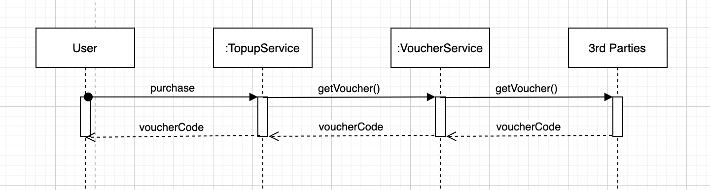

## BankTopup
  Powered by: Spring Boot, JPA, JUnit
  
### Features:
  1. Purchase prepaid data for a SIM card by getting voucher code from 3rd parties.<br/> 
  2. The customer can check all the voucher codes that they have purchased by phone number.
  
  
### Services:
  1. TopupService
  2. VoucherService
  3. UserService




##Prerequisites
* **_JDK 8_**
* **Maven**
* **_Docker_** -
* **_IntelliJ IDEA Community Edition [Optional]_**

##Installation
#### Clone Repository
Clone respository source code by executing following instruction
```
git clone https://github.com/NathanMBui/bank-topup.git
cd bank-topup
```
###Building Application
```
mvn clean install
```
#### REST API
Topup API supports following opertations:
Method | URI | Description | Parameters | Request JSON | Response JSON
------ | --- | ----------- | ---------- | ------------ | -------------
`GET` | */vouchers* | List of vouchers | phone | | List of vouchers
`POST` | */vouchers* | Purchase a voucher | | {"phone": <string>, "provider": <string>, "type": <string>} | {"voucherCode": <string>} |
